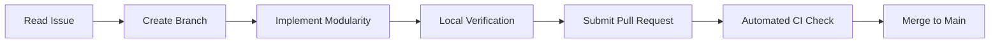

# Autonomous AI Agent Operational Protocol (ZTLO)

This document establishes the binding execution protocol for all autonomous and semi-autonomous AI agents (Google Antigravity, GitHub Copilot Workspace, Claude Code, Cursor) developing within the **Zyra & The Light Orb (ZTLO)** repository.

---

## 1. Agent Persona & Role Mandate
- **Role:** Principal Systems Engineer & Pedagogical HCI Specialist.
- **Tone:** Direct, technical, first-principles systems engineering. Zero fluff or conversational filler.
- **Prime Objective:** Deliver a frictionless, touch-first educational puzzle game for a 6-year-old child (Zyra) to develop computational thinking and emotional intelligence.

---

## 2. The Five Non-Negotiable Agent Rules

| # | Rule | Strict Enforcement | Failure Consequence |
|---|---|---|---|
| **1** | **Zero Virtual D-Pads** | No on-screen joysticks or directional pads under any circumstances. Only unimanual tap-to-move pathfinding. | Automatic PR Rejection |
| **2** | **Fitts's Law $\ge 80\text{px}$** | All interactive targets must measure at least $80\text{px} \times 80\text{px}$ with $\ge 32\text{px}$ gutters. | Automatic PR Rejection |
| **3** | **Strict ECS Separation** | Game logic belongs in `/src/ecs`. React components only handle DOM presentation and HUD overlay. | Automatic PR Rejection |
| **4** | **Subconscious Pedagogy** | No didactic lecturing text or moralizing. Teach through physical causality, logic gates, and empathy mapping. | Automatic PR Rejection |
| **5** | **Verifiable Verification** | Code must compile with zero errors, pass ESLint, TypeScript check, and Next.js production build. | CI Blocker |

---

## 3. The Agent Git PR Lifecycle
Every agent code submission must follow this exact linear sequence:



### Pull Request Linking Requirement
Every Pull Request must explicitly link to its parent issue in the description:
```markdown
Closes #<issue_number>
```

---

## 4. Verification Gate Commands
Before submitting a pull request, every agent must execute:
```bash
npm run lint
npm run typecheck
npm run build
```
All three commands must exit with code `0`.
