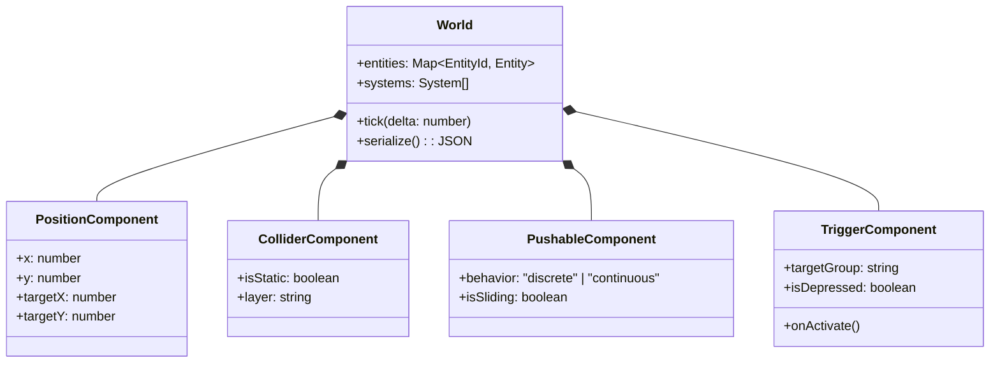

# Systems Architecture & Implementation Roadmap

**Document:** `.wiki/ARCHITECTURE.md`  
**Standard:** langchain/openwiki / Google OKF Standard  
**Cross-References:** [INDEX.md](file:///.wiki/INDEX.md), [CONSTRAINTS.md](file:///.wiki/CONSTRAINTS.md), [CURRICULUM.md](file:///.wiki/CURRICULUM.md)  

---

## 1. Engine Pipeline & Strategy

### A. Evolutionary Roadmap
To balance iterative velocity with long-term scalability and iPad battery/thermal performance, Project ZTLO adopts a staged migration path:

1. **Phase 1 Prototype (Current / Path 3 Minimization):**
   * **Framework:** Next.js 15 (React 19) PWA.
   * **Rendering Layer:** Pure HTML5 DOM + CSS Grid ($16 \times 9$ layout) + Framer Motion.
   * **Advantages:** Zero canvas/WebGL initialization overhead; instantaneous text and vector layout updates; native browser accessibility and touch event handling.
   * **Companion AI:** Rule-based deterministic state machine ("Light Orb") executing Socratic spatial checks.
2. **Phase 2 Expansion (Target / Hybrid Migration):**
   * **Engine:** Phaser 3 canvas encapsulated within a Next.js responsive container.
   * **AI Companion:** On-device localized inference via `@mlc-ai/web-llm` running `SmolLM2-360M-Instruct-q4f16_1-MLC` over WebGPU.
   * **Serialization Bridge:** 500ms decoupled JSON state export synchronizing ECS game state into WebLLM system prompts.

---

## 2. Entity-Component-System (ECS) Architecture

To prevent context collapse and ensure deterministic game state, all game logic is decoupled from React rendering:



### Core Systems
1. **MovementSystem:** Executes discrete A* pathfinding. Consumes destination grid coordinate from tap events; calculates 4-directional obstacle bypass routes; emits step-by-step positions to the `PositionComponent`.
2. **PhysicsSystem:** Evaluates push collisions:
   * **StoneBlock (`discrete`):** Advances exactly 1 grid unit in the impact vector if destination is unblocked.
   * **IceBlock (`continuous`):** Recursively advances along the impact vector until a collider or boundary is encountered.
3. **TriggerSystem:** Evaluates spatial intersections between blocks and `PressurePlate` entities. Updates Boolean logic gates (AND/OR circuits) triggering door/shrine unsealing.

---

## 3. Deployment & iPad Safari Network Bridge

* **Local Binding:** Configured via `package.json`:
  ```json
  "dev": "next dev --experimental-https -H 0.0.0.0"
  ```
* **HTTPS Rationale:** iOS Safari strictly enforces secure context (`isSecureContext === true`) for Web Workers, PWA Service Worker caching, and low-latency Pointer Events. Binding to `0.0.0.0` over HTTPS allows direct testing on local iPad Wi-Fi with complete hardware fidelity.
