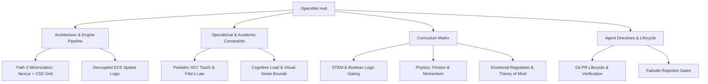

# Project ZTLO OpenWiki Hub

**Document ID:** `WIKI_ZTLO_Home_20260919_v01`  
**Version:** `1.0.0`  
**Revision Date:** `2026-09-19`  
**Last Updated:** `2026-09-19`  
**Status:** Active  
**Standard:** Google OKF / langchain/openwiki Standard  
**Subject:** Zyra & The Light Orb (ZTLO) Engineering & Pedagogical Documentation  
**Primary Target:** 6-Year-Old Early Childhood Learner (Zyra)  
**Primary Hardware:** Apple iPad (Touch-First PWA Environment)  

---

## 1. System Overview

Project ZTLO is a stealth-educational, touch-first puzzle game designed to cultivate foundational computational thinking, physical causality models, and emotional self-regulation in early childhood learners without triggering cognitive drag or motor frustration.

---

## 2. Topic Registry

| Topic Document | Category | Summary Description |
| :--- | :--- | :--- |
| [[Architecture]] | Systems Engineering | Engine teardown, ECS design, DOM vs Canvas roadmap, serialization bridge. |
| [[Constraints]] | HCI & Cognitive Bounds | Empirical constraints from Pediatric HCI ($\ge 80\text{px}$ targets, $\le 50\text{ ms}$ feedback) and Cognitive Load limits. |
| [[Curriculum]] | Pedagogy & STEM | Subconscious curriculum matrix mapping game mechanics to logic, physics, and psychology outcomes. |
| [[Directives]] | Orchestration & Protocol | Operational lifecycle, Git PR protocols, Google OKF documentation standard, and verification gates. |

---

## 3. Engineering Source Documents (`docs/`)

* [Academic Synthesis (Phase 0 Gate)](https://github.com/zsh04/ztlo/blob/main/docs/ENG_ZTLO_Academic-Synthesis_20260919_v01.md)
* [System Philosophy & Master Directives](https://github.com/zsh04/ztlo/blob/main/docs/ENG_ZTLO_System-Philosophy_20260919_v01.md)
* [Agent Directives v03](https://github.com/zsh04/ztlo/blob/main/docs/ENG_ZTLO_Agent-Directives_20260919_v03.md)
* [Architecture Implementation Plan v01](https://github.com/zsh04/ztlo/blob/main/docs/ENG_ZTLO_Architecture-Implementation-Plan_20260919_v01.md)
* [Execution Synthesis v03](https://github.com/zsh04/ztlo/blob/main/docs/ENG_ZTLO_Execution-Synthesis_20260919_v03.md)
* [Local AI & Aesthetic Spec v02](https://github.com/zsh04/ztlo/blob/main/docs/ENG_ZTLO_LocalAI-Aesthetic-Spec_20260919_v02.md)
* [Prototype Kickoff Spec v01](https://github.com/zsh04/ztlo/blob/main/docs/ENG_ZTLO_Prototype-Kickoff-Spec_20260919_v01.md)
* [Task Tracker v02](https://github.com/zsh04/ztlo/blob/main/docs/ENG_ZTLO_Task-Tracker_20260919_v02.md)
* [Level 1-1 Specification: Shrine of Equilibrium](https://github.com/zsh04/ztlo/blob/main/docs/ENG_ZTLO_Level-Design-Shrine-01_20260919_v01.md)
* [WebLLM iPad Feasibility Spike](https://github.com/zsh04/ztlo/blob/main/docs/ENG_ZTLO_WebLLM-Feasibility-Spike_20260919_v01.md)
* [Project Readme v01](https://github.com/zsh04/ztlo/blob/main/docs/ENG_ZTLO_Project-Readme_20260919_v01.md)
