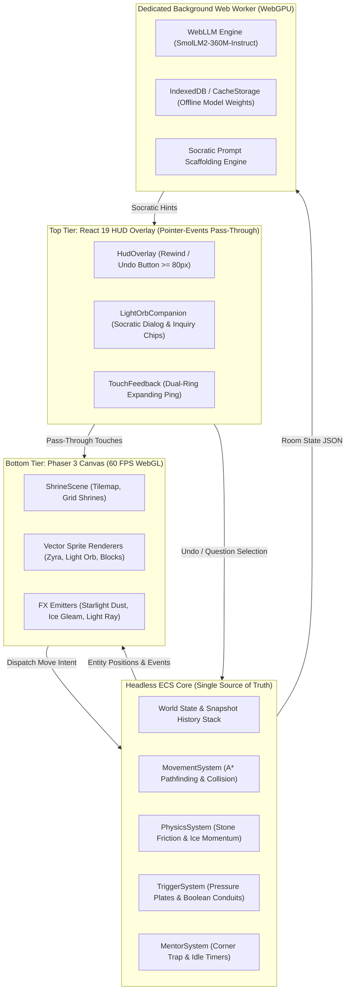

# Architecture Decision Record (ADR): Phase 2 Hybrid Engine & Local WebLLM Architecture

**Document ID:** `ADR_ZTLO_Phase-2-Hybrid-Phaser-WebLLM-Architecture_20260919_v01`  
**Status:** **APPROVED & IMPLEMENTATION IN PROGRESS**  
**Date:** 2026-09-19  
**Authors:** Agile PM, Principal Systems Engineer, Principal AI Systems Engineer  
**Standard:** SOP-WRT-001 (Chain of Custody) / Google OKF Standard  

---

## 1. Context & Architectural Problem

Project *Zyra & The Light Orb (ZTLO)* successfully validated its Phase 1 prototype on Apple iPad hardware with early childhood player Zyra (Age 6). Live empirical telemetry confirmed:
1. **Unimanual Tap-to-Move Pathfinding** ($A^*$) on a discrete grid is completely intuitive ($0$ phantom joystick swipes).
2. **Hitbox Sizing ($\ge 80\text{px}$)** guarantees $100\%$ touch accuracy for pediatric finger motor control.
3. **Physical Causality** (`StoneBlock` high-friction push vs `IceBlock` momentum slide) is immediately grasped without text instructions.

However, scaling beyond the single-room CSS Grid prototype to a full multi-shrine world requires solving two core technical bottlenecks:
- **Rendering Throughput:** Complex multi-tile animated rooms, light beams, particle glows, and starlight effects will cause DOM layout recalculation churn in standard React DOM.
- **Offline AI Guidance Latency:** Running local LLM inference on Mobile Safari must never block the main animation frame loop ($60\text{ FPS} = 16.67\text{ms}$ budget) or exceed WebKit's memory jetsam threshold ($\approx 1.2\text{GB}$).
- **Deadlock Recovery:** In Sokoban-style grid puzzles, pushing heavy blocks into dead corners creates unrecoverable failure states unless accessible undo mechanics exist.

---

## 2. Decision Ledger

### Decision 1: Hybrid Rendering Architecture (Phaser 3 Canvas + React HUD Overlay)
- **Choice:** Maintain a 2-tier rendering stack:
  - **Bottom Tier (Phaser 3 WebGL/Canvas):** Runs the $60\text{ FPS}$ game loop, procedural vector sprite rendering, particle emitters (starlight chimes, dust puffs), and continuous raycasting (optics light beams).
  - **Top Tier (React 19 / Tailwind CSS Overlay):** Renders high-level HUD buttons, the Socratic Light Orb thought bubble, and the inquiry dialogue modal.
- **Touch Routing:** The React container is configured with `pointer-events-none`. Interactive UI buttons (Undo, Companion Tap, Settings) have `pointer-events-auto`. All touches on open grid tiles pass seamlessly through to the underlying Phaser canvas for $A^*$ pathfinding.
- **Aspect Ratio & Resolution:** Virtual canvas resolution locked to $1280 \times 720$ ($16:9$) with `Phaser.Scale.FIT`, automatically centered with zero letterbox distortion on iPad Liquid Retina displays.

### Decision 2: Decoupled Entity-Component-System (ECS) as Single Source of Truth
- **Choice:** Do not use Phaser's built-in Arcade Physics for core puzzle logic.
- **Rationale:** The game logic must remain strictly deterministic, testable in headless Node.js unit test suites (`node --test`), and decoupled from the visual renderer.
- **Mechanics:** All state mutations (coordinates, mass, momentum, trigger activation, undo stack) execute in `/src/ecs/`. The Phaser Scene acts strictly as a reactive subscriber, reading entity states each tick and interpolating sprite positions.

### Decision 3: Local Offline WebLLM in a Dedicated Web Worker
- **Choice:** Embed `@mlc-ai/web-llm` targeting `SmolLM2-360M-Instruct-q4f16_1-MLC` executing inside a separate Web Worker (`src/workers/webllm.worker.ts`).
- **Memory & Jetsam Budget:**
  - Quantized model weights: $140\text{MB}$ download (cached in `CacheStorage` / `IndexedDB`).
  - Active VRAM footprint: $\approx 380\text{MB}$ (well below the $1.2\text{GB}$ WebKit crash threshold).
- **Zero-Block Latency:** The Web Worker communicates via structured `postMessage` calls (`GENERATE_HINT`, `HINT_CHUNK`, `READY`). Even during prompt prefill and token generation, the main UI thread remains pinned at $60\text{ FPS}$.
- **Graceful Fallback:** If WebGPU is unavailable (e.g. older iPads or restricted browsers), the client transparently falls back to the deterministic Socratic state machine (`MentorSystem.ts`).

### Decision 4: Gentle Undo / Block Rewind & Pre-Defined Socratic Inquiry Chips
- **Choice:** Implement an accessible HUD Undo button ($\ge 80\text{px} \times 80\text{px}$) and a pre-defined inquiry sheet on the Light Orb companion.
- **Pedagogical Principles:**
  - When the child traps a block in a corner, the Light Orb detects the condition and prompts: *"Oops, that corner is tight! Would you like to rewind one step together?"*
  - Tapping the Light Orb displays 3 pre-defined child inquiry chips (*"What should we look for?"*, *"Why did the block stop?"*, *"Can we take a step back?"*).
  - Strictly zero imperative spoil instructions.

---

## 3. System Architecture Diagram

---

## 4. Consequences & Trade-offs

| Positive Consequences | Architectural Debt & Mitigations |
| :--- | :--- |
| **Zero Frame Drops:** Offloading LLM inference to a Web Worker keeps the $60\text{ FPS}$ game loop completely smooth. | **Asset Duplication:** Textures must be loaded into Phaser while React manages SVG UI assets. *Mitigation: Shared SVG asset pipeline in `/public/assets`.* |
| **Offline Privacy:** No child gameplay data leaves the device; zero API tokens or remote network calls required. | **Cold-Start Download:** $140\text{MB}$ initial weight download on first boot. *Mitigation: Persistent caching in CacheStorage; clear download progress meter.* |
| **Zero Motor Frustration:** Fitts's Law touch targets and instantaneous Undo eliminate corner-trap abandonment. | **State Synchronization Overhead:** ECS state must be serialized cleanly to Phaser view components each frame. *Mitigation: Diff-based dirty flag checks.* |

---

## 5. Traceability & Commitments

- **Closes Issues:** [Issue #26](https://github.com/zsh04/ztlo/issues/26), [Issue #27](https://github.com/zsh04/ztlo/issues/27)
- **Unblocks Issues:** [Issue #6](https://github.com/zsh04/ztlo/issues/6) (Phaser 3 Canvas Migration), [Issue #7](https://github.com/zsh04/ztlo/issues/7) (WebLLM Integration)
