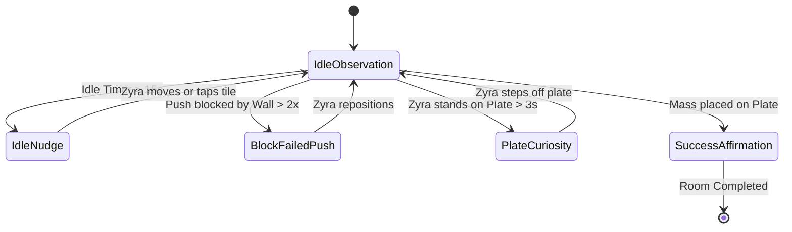

# Level 1-1 Specification: Shrine of Equilibrium

## 1. Executive Summary & Curriculum Mapping

**Shrine of Equilibrium** serves as the introductory micro-dungeon for *Zyra & The Light Orb (ZTLO)*. It introduces early childhood players (target Age 6) to spatial navigation, mass causality, and switch activation without overt tutorials or didactic lecturing.

| Pedagogical Domain | Game Mechanic | Subconscious Learning Outcome |
| :--- | :--- | :--- |
| **Physics (Mass & Friction)** | Moving `StoneBlock` (1 tile push) vs. `IceBlock` (momentum slide) | Friction, momentum, causality, mass prediction |
| **Logic & Sequencing** | Positioning mass on `PressurePlate` to de-energize gate barriers | Boolean state gating (`IF mass ON plate THEN door = OPEN`) |
| **Pediatric Spatial Motor** | Unimanual tap-to-move pathfinding with radial touch ripples | Goal-directed pathing, zero motor frustration |
| **Emotional Regulation** | Socratic questioning prompts when idle or stuck | Frustration tolerance, curiosity over failure anxiety |

---

## 2. Room Spatial Geometry & Tilemap Matrix

The room uses an **8-column $\times$ 6-row** grid. Each tile measures $80\text{px} \times 80\text{px}$ minimum on tablet displays to satisfy Fitts's Law.

```
      Col 0    Col 1    Col 2    Col 3    Col 4    Col 5    Col 6    Col 7
    ┌────────┬────────┬────────┬────────┬────────┬────────┬────────┬────────┐
R 0 │  WALL  │  WALL  │  WALL  │  WALL  │  WALL  │  WALL  │  WALL  │  WALL  │
    ├────────┼────────┼────────┼────────┼────────┼────────┼────────┼────────┤
R 1 │  WALL  │ [ORB]  │ FLOOR  │ FLOOR  │ FLOOR  │ FLOOR  │ FLOOR  │  WALL  │
    ├────────┼────────┼────────┼────────┼────────┼────────┼────────┼────────┤
R 2 │  WALL  │ [ZYRA] │ FLOOR  │[STONE] │ FLOOR  │ FLOOR  │[PLATE] │ [DOOR] │
    ├────────┼────────┼────────┼────────┼────────┼────────┼────────┼────────┤
R 3 │  WALL  │ FLOOR  │ FLOOR  │ WALL   │ FLOOR  │ FLOOR  │ FLOOR  │  WALL  │
    ├────────┼────────┼────────┼────────┼────────┼────────┼────────┼────────┤
R 4 │  WALL  │ FLOOR  │ FLOOR  │ FLOOR  │ [ICE]  │ FLOOR  │ FLOOR  │  WALL  │
    ├────────┼────────┼────────┼────────┼────────┼────────┼────────┼────────┤
R 5 │  WALL  │  WALL  │  WALL  │  WALL  │  WALL  │  WALL  │  WALL  │  WALL  │
    └────────┴────────┴────────┴────────┴────────┴────────┴────────┴────────┘
```

### Entity Coordinate Registry

| Entity | Initial Grid Position `(col, row)` | Behavior / Physics Archetype | Visual Asset Key |
| :--- | :--- | :--- | :--- |
| **Zyra (Avatar)** | `(1, 2)` | Unimanual A* tap-to-move; 150ms per tile transition | `avatar_zyra` |
| **Light Orb** | `(1, 1)` | Floats with smooth spring follow; radial amber pulse | `companion_light_orb` |
| **StoneBlock** | `(3, 2)` | Pushable; high friction; advances exactly 1 tile per push | `entity_stone_block` |
| **IceBlock** | `(4, 4)` | Pushable; zero friction; slides continuously until obstacle | `entity_ice_block` |
| **PressurePlate** | `(6, 2)` | Trigger; depressed state when mass $\ge 40\text{kg}$ occupies tile | `trigger_pressure_plate` |
| **Barrier Door** | `(7, 2)` | Solid collider when closed; opens when `PressurePlate` active | `door_sanctuary_exit` |

---

## 3. Kinetic & Physics Rule Set

1. **StoneBlock (Grid-Snap Push):**
   - When Zyra taps adjacent to `StoneBlock` in the vector of the block, Zyra executes a push.
   - The block advances exactly **1 tile** in the push direction, provided the destination tile is walkable and free of colliders.
   - Deceleration: Instant grid-snap. Velocity $v = 0$ upon 1-tile movement.
2. **IceBlock (Momentum Slide):**
   - When pushed, `IceBlock` enters `SLIDING` state with constant velocity ($300\text{px/s}$) in the direction of impulse.
   - Continues in a straight vector until colliding with a `WALL`, another entity, or an edge boundary.
   - Produces a soft crystalline chime upon collision and stops at the adjacent open tile.
3. **PressurePlate Trigger:**
   - Detects `CollisionEnter` from `StoneBlock`, `IceBlock`, or `Zyra`.
   - Emits an energizing glow signal to `door_sanctuary_exit`.
   - Gate state shifts: `Door.isLocked = false`, triggering an inviting unlock chime and soft pastel particle glow.

---

## 4. Deterministic Socratic Dialogue Tree (Issue #4 Specification)

The Light Orb companion does not provide direct commands. It observes room state and delivers gentle, open-ended reflections based on player behavior.

### Socratic Trigger Matrix



### Scripted Dialogue Strings

| Trigger ID | Condition | Socratic Orb Dialogue String | Audio Cue |
| :--- | :--- | :--- | :--- |
| `HINT_IDLE_INTRO` | Player stationary $>15\text{s}$ at start | *"The path ahead seems quiet... I wonder where that soft light is coming from?"* | Gentle chime |
| `HINT_PLATE_STAND` | Zyra stands on `(6, 2)` $>3\text{s}$ | *"Look at that! The door woke up when you stepped here. What happens if you need to walk through?"* | Harmonic hum |
| `HINT_STONE_WALL` | Player pushes `StoneBlock` toward `(3, 3)` wall | *"Hmm, the stone feels solid against the wall. Can it move in a different direction?"* | Low soft thud |
| `HINT_ICE_MOMENTUM` | Ice block pushed and slides across room | *"Whoosh! That was fast! It just kept going until it bumped the wall!"* | Crystalline glissando |
| `HINT_SOLVED` | `StoneBlock` rests on `PressurePlate` | *"The gate is open! Balance has returned to this room."* | Chime of harmony |

---

## 5. Verification & Acceptance Criteria for Developers

- [ ] Room coordinates map exactly to the 8x6 grid.
- [ ] No virtual joysticks appear on screen; tap-to-move pathfinding navigates Zyra around the `StoneBlock` without snagging.
- [ ] Pushing the `StoneBlock` onto `(6, 2)` opens the door at `(7, 2)`.
- [ ] Stepping onto the door tile triggers the level completion transition.
- [ ] All touch zones adhere to $\ge 80\text{px} \times 80\text{px}$ touch targets.
