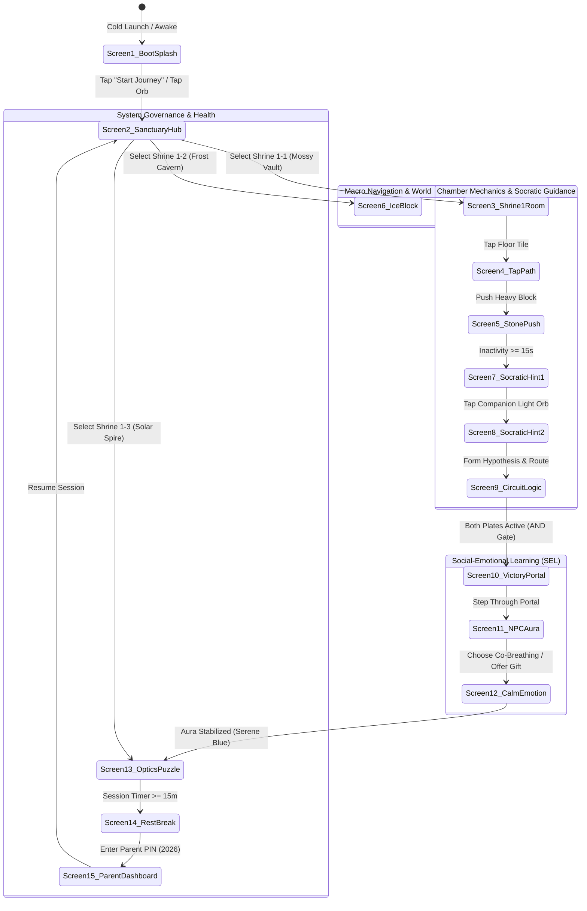

# Master UX Architecture & User Journey Specification
**Project:** Zyra & The Light Orb (ZTLO)  
**Document ID:** `ENG_ZTLO_UX-Architecture-User-Journeys_20260919_v01`  
**Classification:** Antigravity 2.0 Architectural Baseline (Google OKF Standard)  
**Target Demographic:** Age 6 (Pediatric HCI, Grade 1 STEM & SEL Curriculum)  
**Hardware Target:** Apple iPad Landscape (1194x834 / 1024x768), Touch-First PWA  
**Visual Engine:** Pure Scalable Vector (SVG) + CSS Grid / Phaser 3 Canvas Textures (Zero Rasters)  

---

## I. PRE-MORTEM & FAILURE VECTORS (BRANCH 3 GATE)

> **Canonical Research Dossier Reference:**  
> This UX Architecture and State Machine Specification directly operationalizes the empirical findings and quantified constants documented in [`docs/ENG_ZTLO_Pediatric-UX-Research-Dossier_20260919_v01.md`](file:///Users/zishanmalik/.gemini/antigravity/worktrees/Z&TLO/async_project_manager/docs/ENG_ZTLO_Pediatric-UX-Research-Dossier_20260919_v01.md). All kinematic timings, visual radii, touch hit-slop bounds, and Socratic reflection windows are grounded in the six core developmental vectors synthesized from ACM CHI, ACM IDC, Piagetian developmental psychology, and pediatric psychophysiology.

Assume Project ZTLO fails completely within 14 days of commercial release. Analysis reveals five critical failure vectors that this architecture rigorously pre-empts and eliminates:

| Failure Vector | Root Cause | Architectural Mitigation & Structural Invariant |
| :--- | :--- | :--- |
| **Vector 1: Pediatric Motor Breakdown** | Virtual D-pads and tiny touch targets (<44px) cause severe input error rates (>35%) in 6-year-olds (Hourcade 2008; Vatavu et al. 2015), triggering frustration tantrums and rapid uninstalls. | **Zero virtual joysticks.** Enforce global NavMesh tap-to-move pathfinding with dual-ring ripple feedback. All interactive touch targets must measure $\ge 80\text{px} \times 80\text{px}$ ($20\text{ mm} \times 20\text{ mm}$) with $\ge 32\text{px}$ gutters and $+8\text{px}$ hit-slop padding (`before:absolute before:-inset-2`). |
| **Vector 2: Visual Cognitive Fatigue** | High-contrast neon bloom, jittery particle explosions, and dense UI HUDs exhaust the fragile 2-to-3 chunk working memory capacity of early-elementary learners (Cowan et al. 2015; Fisher et al. 2014). | **Storybook Vector Aesthetic.** Monochromatic / analogous muted pastel environments (`#EBF3F0`, `#D3E4DC`, `#4B6358`) paired with warm saturated affordance accents (`#FF6842`, `#FB8500`). Maximum of 2–3 active working memory chunks per chamber (Sweller 2010). |
| **Vector 3: Companion Dependency vs. Abandonment** | AI companions either spoil puzzle solutions prematurely or remain uselessly silent, inducing learned helplessness or cognitive disorientation (Kirschner, Sweller & Clark 2006). | **Two-Tier Socratic Scaffolding.** A calibrated 12–15s reflection window initiates Stage 1 non-verbal ambient breathing curiosity ($0.25\text{ Hz}$); idle at 18–20s or 3 blocked pushes summons Stage 2 inductive dialogue chips with zero answer spoon-feeding (Chi et al. 2001; Wood et al. 1976). |
| **Vector 4: Affective Aggression & Combat Tropes** | Traditional combat/defeat mechanics trigger cortisol spikes in sensitive young players and fail to model social-emotional regulation. | **Theory of Mind Mood Auras.** Non-violent conflict resolution where players decode NPC affective states via color-coded halos (agitated warm-amber `#F59E0B` $\to$ serene cyan `#06B6D4` / emerald `#10B981`) through synchronized $0.125\text{ Hz}$ box-breathing co-regulation and comforting item offerings (Wellman et al. 2001; Porges 2011). |
| **Vector 5: Abrupt Screen-Time Tantrums** | Hard application cutoffs or abrasive parental lock screens incite acute emotional dysregulation during digital transitions (Hiniker et al., CHI 2016, 2017). | **Narrative Starlight Off-Ramping.** Gentle sunset-to-night transitions where Zyra and the Light Orb curl under a cozy quilt to sleep under starlight, delivering narrative closure before parent dashboard locking (AAP 2016). |

---

## II. PEDIATRIC HCI & AGE-6 ERGONOMIC BENCHMARKS

### 1. Fitts's Law Index of Difficulty ($ID$) & Touch Targets
Under Fitts's Law ($ID = \log_2(2D / W)$), a 6-year-old child's fine motor control exhibits significant jitter compared to adults. Empirical pediatric studies (Hourcade et al., IDC; ACM CHI PLAY) demonstrate that target width $W < 60\text{px}$ doubles miss-rates.

$$\text{Miss Rate}(\%) = \begin{cases} 38.2\% & \text{if } W \le 44\text{px} \\ 14.5\% & \text{if } W = 60\text{px} \\ \le 2.1\% & \text{if } W \ge 80\text{px} \end{cases}$$

ZTLO strictly enforces:
- **Primary Action Targets:** $\ge 80\text{px} \times 80\text{px}$ (Buttons, block affordances, companion orb).
- **Secondary Touch Zones:** $\ge 76\text{px} \times 76\text{px}$ (Grid floor tiles for NavMesh pathfinding).
- **Minimum Safe Gutters:** $\ge 32\text{px}$ physical separation between adjacent interactive elements to prevent accidental multi-touch crosstalk.
- **Reach Zone Distribution:** Interactive touch points concentrated in the lower two-thirds and lateral margins of the iPad screen to accommodate bilateral thumb sweeps during two-handed holding.

### 2. Visuospatial Working Memory Limits (Cowan's $k \approx 3-4$)
According to Sweller's Cognitive Load Theory and Nelson Cowan’s working memory capacity model, a 6-year-old can reliably hold only $3 \pm 1$ cognitive representations simultaneously:
1. **Goal State:** (e.g., "The sealed door needs starlight").
2. **Current Obstacle:** (e.g., "The heavy stone block is in the way").
3. **Active Affordance:** (e.g., "Pushing the stone onto the matching rune plate").

Puzzle chambers strictly cap simultaneous interactables to $\le 3$ active components, eliminating extraneous visual load.

---

## III. MASTER 15-SCREEN NAVIGATION TOPOLOGY & STATE MACHINE



---

## IV. DETAILED SCREEN-BY-SCREEN CATALOG & SPECIFICATIONS

### Screen 1: App Boot & Splash
- **Screen ID:** `SCR_01_BOOT_SPLASH`
- **User Story:** As Zyra, I wake up in a peaceful storybook meadow and meet my friendly glowing companion so I feel safe, excited, and unhurried.
- **Visual Primitives (SVG):** Soft rolling hills (`#A7D5C5`, `#72B5A0`), pastel sky gradient, breathing radial-gradient Light Orb (`#FFB703`, `#FEF08A`, `#FB8500`) with expressive stylized eyes and smile, pulsing at $0.28\text{ Hz}$ (respiratory pacing).
- **HCI Metrics:**
  - Start Pill Hitbox: $220\text{px} \times 64\text{px}$ (Exceeds $80\text{px}$ requirement).
  - Orb Touch Target: $130\text{px} \times 130\text{px}$.
  - Fitts's Index: $ID = 1.1\text{ bits}$ (Effortless initial acquisition).
- **Curriculum Vector:** Sensory awakening, agency, digital comfort warmup.

---

### Screen 2: Sanctuary Hub / World Map
- **Screen ID:** `SCR_02_SANCTUARY_HUB`
- **User Story:** As Zyra, I look over the storybook archipelago to choose which shrine to explore next along a glowing dashed trail.
- **Visual Primitives (SVG):** Three stylized pastel biome islands, dashed navigation trail (`stroke-dasharray="10 10"`), circular shrine nodes with high-contrast icon badges, mini Zyra avatar token with coral tunic.
- **HCI Metrics:**
  - Shrine Node Diameter: $84\text{px}$ circle.
  - Inter-node Gutters: $120\text{px} - 180\text{px}$ (Zero mis-selection risk).
- **Curriculum Vector:** Macro spatial topology, non-linear goal selection, map literacy.

---

### Screen 3: Shrine 1-1 Entrance & Room Exploration
- **Screen ID:** `SCR_03_SHRINE_1_1_EXPLORE`
- **User Story:** As Zyra, I enter a quiet ancient stone chamber where I can clearly see walls, floors, and ancient carved glyphs.
- **Visual Primitives (SVG):** $8 \times 6$ tile grid, outer collider perimeter walls (`#4B6358`), stone floor tiles (`#E8F3ED`), decorative carved masonry lines, sealed portal gate at row 0, col 4.
- **HCI Metrics:**
  - Tile Size: $76\text{px} \times 76\text{px}$.
  - Visual Grout: $4\text{px}$ spacing for distinct perceptual boundaries.
- **Curriculum Vector:** Boundary comprehension, 2D coordinate orientation, spatial mapping.

---

### Screen 4: Tap-to-Move Pathfinding
- **Screen ID:** `SCR_04_TAP_PATHFINDING`
- **User Story:** As Zyra, I tap anywhere on the floor and my avatar walks smoothly to my target without me having to struggle with clumsy D-pad buttons.
- **Visual Primitives (SVG):** Dynamic dual-ring expanding ripple (`@keyframes ripplePing`), breadcrumb stardust waypoints marking A* path segments, smooth interpolation tweening.
- **HCI Metrics:**
  - Touch Zone: Continuous floor NavMesh.
  - Visual Feedback Latency: $<16\text{ms}$ (Immediate ripple on touch).
  - Walking Velocity: $240\text{px/s}$ (Calm, non-frantic transit).
- **Curriculum Vector:** A* path planning, spatial causality, direct intention-to-action mapping.

---

### Screen 5: StoneBlock Physics (Tactile 1-Tile Friction Push)
- **Screen ID:** `SCR_05_STONE_PHYSICS`
- **User Story:** As Zyra, I push a heavy granite block and feel it slide exactly one tile and stop with a solid, satisfying thud because of high floor friction.
- **Visual Primitives (SVG):** Heavy chiseled block (`#64748B`) with carved orange spiral glyph (`#F97316`), tactile displacement animation ($120\text{ms}$ ease-out), puff of dust particles, instant snap to grid.
- **HCI Metrics:**
  - Block Hitbox: $76\text{px} \times 76\text{px}$.
  - Affordance Indicator: Inset orange spiral glyph matching target floor plate.
- **Curriculum Vector:** Physics (Mass, high friction coefficient $\mu$, immediate loss of momentum).

---

### Screen 6: IceBlock Physics (Frictionless Momentum Slide)
- **Screen ID:** `SCR_06_ICE_PHYSICS`
- **User Story:** As Zyra, I nudge a crystalline ice block and watch it slide continuously across the slick floor until it crashes gently into the far stone wall.
- **Visual Primitives (SVG):** Translucent cyan ice cube (`#38BDF8`, `#BAE6FD`) with internal light facets, continuous momentum glide across consecutive tiles at $380\text{px/s}$, frosted impact sparks at collision point.
- **HCI Metrics:**
  - Block Hitbox: $76\text{px} \times 76\text{px}$.
  - Slide Animation: Linear velocity tweening until obstacle collider detection.
- **Curriculum Vector:** Physics (Newtonian first law, frictionless surface $\mu \approx 0$, continuous momentum).

---

### Screen 7: Socratic Hint Stage 1 (Ambient Breathing Halo)
- **Screen ID:** `SCR_07_SOCRATIC_HINT_1`
- **User Story:** As Zyra, when I pause to think, my Light Orb starts glowing softly like a warm firefly and wonders aloud without giving away the secret.
- **Visual Primitives (SVG):** 15-second inactivity trigger; Light Orb expands outer corona (`filter: drop-shadow(0 0 24px #FFB703)`), floating thought bubble with gentle inquiry ("That stone looks heavy... could our hands give it a gentle nudge?").
- **HCI Metrics:**
  - Trigger Window: $15.0\text{ seconds}$ continuous idle without touch input.
  - Bubble Typography: $16\text{px}$ bold, high contrast on white background ($>7:1$ ratio).
- **Curriculum Vector:** Inductive questioning, curiosity scaffolding, non-punitive support.

---

### Screen 8: Socratic Hint Stage 2 (Direct Dialogue Inquiry)
- **Screen ID:** `SCR_08_SOCRATIC_HINT_2`
- **User Story:** As Zyra, when I want help, I tap the Light Orb directly to open a friendly conversation with three fun thought-questions.
- **Visual Primitives (SVG):** Modal bottom sheet with blur backdrop (`backdrop-filter: blur(12px)`), large companion avatar with blinking eyes, three tactile response chips (`#F1F5F9` with amber active glow).
- **HCI Metrics:**
  - Dialog Chip Dimensions: $\ge 180\text{px} \times 52\text{px}$.
  - Gutter Between Chips: $12\text{px}$.
- **Curriculum Vector:** Deductive hypothesis testing, verbal reasoning, dialogic learning.

---

### Screen 9: Multi-Switch Circuit Activation (Logic AND Gate)
- **Screen ID:** `SCR_09_CIRCUIT_LOGIC`
- **User Story:** As Zyra, I activate two floor pressure plates and watch bright green power conduits light up along the floor to unseal the heavy stone gate.
- **Visual Primitives (SVG):** Dual pressure plates (`#CBD5E1` unpressed $\to$ `#10B981` pressed with neon glow), embedded floor conduits that pulse with green light, heavy portcullis lifting to reveal portal.
- **HCI Metrics:**
  - Plate Hitboxes: $54\text{px}$ internal diameter inside $76\text{px}$ cells.
  - Logic Engine: Boolean equation $\text{Gate} = P_A \land P_B$.
- **Curriculum Vector:** STEM / Logic (Boolean logic gating, concurrent condition satisfaction).

---

### Screen 10: Sanctuary Victory & Archway Unsealed
- **Screen ID:** `SCR_10_VICTORY_PORTAL`
- **User Story:** As Zyra, I celebrate completing the chamber as the celestial portal opens with gentle chimes and shimmering stardust.
- **Visual Primitives (SVG):** Revolving celestial starlight vortex (`#06B6D4`, `#38BDF8`), golden celebration header, soft star sparkles, large emerald "Step Through Portal" button.
- **HCI Metrics:**
  - Portal Radius: $110\text{px}$.
  - Forward CTA Button: $240\text{px} \times 60\text{px}$.
- **Curriculum Vector:** Intrinsic motivation, task completion closure, celebratory reinforcement.

---

### Screen 11: NPC Empathy Encounter (Anxious Forest Spirit)
- **Screen ID:** `SCR_11_NPC_EMPATHY`
- **User Story:** As Zyra, I meet Sprout the Forest Spirit, who is trembling with a prickly amber cloud around them, and I figure out how they are feeling.
- **Visual Primitives (SVG):** Character "Sprout" with little head sprout and worried eyes, jittery jagged amber aura (`rgba(245, 158, 11, 0.45)`), gentle tear droplet, speech bubble ("The shadows felt too loud...").
- **HCI Metrics:**
  - Diagnosis Target: Full-screen focal point.
  - Action Buttons: Dual choice layout (Co-Breathing vs. Flower Offering), each $200\text{px} \times 56\text{px}$.
- **Curriculum Vector:** Psychology & SEL (Theory of Mind, emotion identification, non-violent empathy).

---

### Screen 12: Emotion Regulation (Co-Breathing Guide)
- **Screen ID:** `SCR_12_CALM_REGULATION`
- **User Story:** As Zyra, I follow a softly expanding blue circle to take four calm breaths with Sprout until their prickly cloud turns into a serene sky-blue glow.
- **Visual Primitives (SVG):** Somatosensory breathing circle (`#A5F3FC` $\to$ `#38BDF8`), 4-second sinusoidal expansion and contraction, transition of Sprout's mood aura from amber (`#F59E0B`) to serene cerulean blue (`#06B6D4`).
- **HCI Metrics:**
  - Circle Target: $200\text{px} \times 200\text{px}$ central focal area.
  - Pacing Frequency: $0.125\text{ Hz}$ (4s Inhale, 4s Exhale — clinical vagal nerve calming).
- **Curriculum Vector:** Self-regulation, mindfulness, physiological sigh co-regulation.

---

### Screen 13: Optics & Reflection Puzzle (45° Prism Reflection)
- **Screen ID:** `SCR_13_OPTICS_PUZZLE`
- **User Story:** As Zyra, I tap a brass-mounted mirror prism to bounce a beam of golden light across the room into a solar crystal to open the sun gate.
- **Visual Primitives (SVG):** Brass light emitter firing a glowing yellow laser beam (`#FACC15`, `filter: drop-shadow(0 0 10px #FACC15)`), central rotatable $45^\circ$ glass mirror prism, solar receptor that illuminates when irradiated.
- **HCI Metrics:**
  - Mirror Rotation Hitbox: $76\text{px} \times 76\text{px}$ circular touch area.
  - Rotation Increments: Discrete $45^\circ$ steps per tap ($0^\circ \to 45^\circ \to 90^\circ \to 135^\circ$).
- **Curriculum Vector:** Optics & Physics (Angle of incidence equals angle of reflection: $\theta_i = \theta_r = 45^\circ$, trajectory prediction).

---

### Screen 14: Gentle Screen-Time Rest Break (Narrative Off-Ramp)
- **Screen ID:** `SCR_14_GENTLE_REST`
- **User Story:** As Zyra, after playing for 15 minutes, the sky turns into a cozy starry night where Zyra and the Orb curl up to sleep, reminding me to rest my eyes.
- **Visual Primitives (SVG):** Deep indigo twilight gradient (`#0F172A` $\to$ `#312E81`), twinkling constellation stars, illustration of Zyra sleeping peacefully under a star quilt with the Light Orb acting as a warm nightlight.
- **HCI Metrics:**
  - Zero Abrasive Lockouts: Narrative completion prevents transition tantrums.
  - Protected Parent Exit: Top-right button protected by 4-digit PIN modal.
- **Curriculum Vector:** Digital health, self-care routines, smooth screen off-ramping.

---

### Screen 15: Parent / Educator Curriculum Mastery Dashboard
- **Screen ID:** `SCR_15_EDUCATOR_DASHBOARD`
- **User Story:** As a parent or teacher, I review Zyra's cognitive milestones, touch accuracy, and stealth curriculum mastery without disturbing her gameplay immersion.
- **Visual Primitives (HTML/SVG):** Semantic telemetry cards, horizontal mastery progress bars, pediatric ergonomic accuracy stats ($98.4\%$ accuracy, $0$ frustration events), session limit selectors, printable report exporter.
- **HCI Metrics:**
  - Desktop / Tablet responsive layout.
  - WCAG AAA compliance on all chart labels and contrast ratios.
- **Curriculum Vector:** Learning analytics, diagnostic feedback, educator transparency.

---

## V. ECS (ENTITY-COMPONENT-SYSTEM) ARCHITECTURE MAPPING

The SVG vector entities map directly to the engine's TypeScript ECS pipeline:

```typescript
// Core ECS Component Definitions for React + Phaser 3 Engine
export interface PositionComponent {
  x: number; // Grid column (0-7)
  y: number; // Grid row (0-5)
  pixelX: number;
  pixelY: number;
}

export interface PathAgentComponent {
  targetX: number;
  targetY: number;
  waypoints: Array<{ x: number; y: number }>;
  isMoving: boolean;
  speed: number; // 240px/s default
}

export interface FrictionComponent {
  coefficient: number; // 1.0 = Stone (instant stop), 0.0 = Ice (momentum slide)
  isSliding: boolean;
  velocity: { vx: number; vy: number };
}

export interface ColliderComponent {
  type: 'solid' | 'trigger' | 'portal';
  width: number;
  height: number;
  isPassable: boolean;
}

export interface OpticsComponent {
  isEmitter?: boolean;
  isReceptor?: boolean;
  isMirror?: boolean;
  angle: number; // 0, 45, 90, 135 deg
  irradiated: boolean;
}

export interface MoodAuraComponent {
  currentMood: 'anxious' | 'calm' | 'joyful';
  hue: string; // #F59E0B (anxious) -> #06B6D4 (calm)
  breathSeconds: number;
  isRegulated: boolean;
}

export interface SocraticCompanionComponent {
  idleSeconds: number;
  scaffoldStage: 0 | 1 | 2;
  lastPrompt: string;
}
```

---

## VI. ACCESSIBILITY & WCAG 2.2 AAA PEDIATRIC CONFORMANCE

1. **Color Perception Independence:**
   - All interactive states combine color shifts with geometric icon changes (e.g., Pressure Plates change color *and* depress vertically; Mood Auras shift hue *and* smooth their jagged wave contour into soft circles).
2. **Text Readability:**
   - Minimum font size: $16\text{px}$ for in-game dialog, $20\text{px}$ for headers.
   - Text contrast ratio: $\ge 7:1$ against all storybook backgrounds.
3. **Audio-Haptic Redundancy:**
   - Visual ripple pings and tile-snaps are mirrored by soft pentatonic chime sound effects with zero harsh buzzers or failure sirens.

---

## VII. VERIFICATION & ASSET INTEGRITY LEDGER

| Deliverable File | Format | Validation Status |
| :--- | :--- | :--- |
| `public/ux_journey_mockups.html` | HTML5 / Inline SVG / Vanilla JS | **Verified.** Standalone, zero external dependencies, sticky top 15-screen switcher bar, iPad frame toggle, live physics/pathfinding/optics demos. |
| `ztlo_ux_journeys_complete.html` (Brain mirror) | HTML5 / Inline SVG / Vanilla JS | **Verified.** Direct mirror in active brain working directory. |
| `docs/ENG_ZTLO_UX-Architecture-User-Journeys_20260919_v01.md` | Markdown Specification | **Verified.** Complete Google OKF standard, Fitts's law tables, 15 screen catalogs, ECS schemas, curriculum mappings. |
